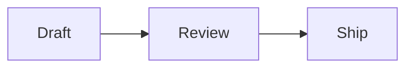

# Markdown Syntax Guide

Trypthos reads and renders **GitHub Flavored Markdown** (GFM): the CommonMark
specification, plus the GitHub extensions for tables, task lists, strikethrough
and automatic links. It also renders **Obsidian Flavored Markdown** - see the
section of that name below - for notes written in Obsidian.

This guide is part of the app rather than a file in your folder. It opens in a
tab like any document, and it is read-only: nothing here can be changed and
nothing is ever saved.

Every example below shows the markdown first and what it produces underneath.
Switch to **Preview** to see them rendered, and to **Source** to use the
formatting toolbar.

---

## Headings

Six levels, written as one to six hashes followed by a space.

```
# Heading 1
## Heading 2
### Heading 3
#### Heading 4
##### Heading 5
###### Heading 6
```

The toolbar has buttons for the first three levels. A heading button works on
the line the cursor is on, whether or not anything is selected: press it once to
make the line a heading, press the same level again to turn it back into a
paragraph, or press a different level to change it.

---

## Emphasis

```
*italic* or _italic_
**bold** or __bold__
***bold italic***
~~struck through~~
```

*italic*, **bold**, ***bold italic***, ~~struck through~~.

Bold, italic, strikethrough and inline code work on the selected text: select a
few words and press the button, and the markers go on either side. Press it
again with the same text selected and they come off. With nothing selected, the
word the cursor is in is used.

---

## Lists

A bullet list uses `-`, `*` or `+`. Trypthos writes `-`.

```
- First item
- Second item
  - Nested item, indented by two spaces
```

- First item
- Second item
  - Nested item, indented by two spaces

A numbered list uses a number followed by a full stop.

```
1. First item
2. Second item
3. Third item
```

1. First item
2. Second item
3. Third item

A task list is a bullet list whose items carry a box. This is a GitHub
extension, not part of CommonMark.

```
- [ ] Not done yet
- [x] Done
```

- [ ] Not done yet
- [x] Done

The three list buttons convert between one kind and another rather than adding a
second marker, so a bulleted list becomes a numbered one in a single press.

---

## Links and images

```
[Link text](https://example.com)
[A file in this folder](notes/today.md)
[With a tooltip](https://example.com "Shown on hover")
<https://example.com>
https://example.com
```

The last two forms are automatic links: a bare address becomes a link without
any markup around it.

A link to a markdown file in your open folder opens that file in a new tab. A
web address opens in your browser. Hover over any link to see where it goes, and
in **Live** view hold Ctrl (Cmd on macOS) and click to follow it.

An image is a link with an exclamation mark in front of it, and the text in
brackets is the description read aloud in place of the picture.

```

```

---

## Code

Inline code goes between single backticks.

```
Run `npm test` before pushing.
```

Run `npm test` before pushing.

A code block goes between two lines of three backticks. The word after the
opening backticks names the language.

    ```js
    const total = items.length;
    ```

Trypthos does not colour code inside a block: the editor already colours the
document by role, and a second, separate idea of what a token is would only
disagree with the first.

---

## Quotes

```
> A quoted passage.
> It can run to several lines.
>
> > And it can contain another quote.
```

> A quoted passage.
> It can run to several lines.
>
> > And it can contain another quote.

---

## Tables

Tables are a GitHub extension. Columns are separated by pipes, and the second
row sets the alignment: `---` for the default, `:---` for left, `:---:` for
centred and `---:` for right.

```
| Feature | Supported | Notes |
| --- | :---: | ---: |
| Tables | Yes | GitHub extension |
| Footnotes | No | Not part of GFM |
```

| Feature | Supported | Notes |
| --- | :---: | ---: |
| Tables | Yes | GitHub extension |
| Footnotes | No | Not part of GFM |

The cells do not have to line up in the source. The table button inserts a small
table for you to type over.

---

## Horizontal rules

Three or more hyphens, asterisks or underscores on a line of their own.

```
---
```

A rule needs a blank line above it. Three hyphens directly under a line of text
means something else: it makes that line a heading.

---

## Paragraphs and line breaks

A blank line starts a new paragraph. A single newline does not break the line -
the two lines are joined into one paragraph when rendered. To break a line
without starting a paragraph, end it with two spaces.

```
This line ends with two spaces,
so this one begins a new line in the same paragraph.

This is a new paragraph.
```

---

## Escaping

Put a backslash in front of a character to stop it being read as markdown.

```
\*not italic\*
```

\*not italic\*

---

## HTML

Plain HTML is allowed and is passed through to the rendered view, where it is
sanitised first: anything that could run code, such as a script tag or an event
handler, is removed. The **Live** and **Source** views show HTML as the text you
typed.

---

## What GitHub renders beyond GFM

GitHub shows a few things the GFM specification does not define. Preview shows
them the same way, whichever flavour a document is in.

Footnotes are numbered in the order they are referred to, and gathered at the
end of the document:

```md
A claim that needs a source.[^1]

[^1]: The source.
```

Alerts are a quote whose first line is one of five markers, alone:

```md
> [!NOTE]
> Useful information.
```

The five are `NOTE`, `TIP`, `IMPORTANT`, `WARNING` and `CAUTION`.

Front matter - properties between `---` lines at the very top of a file - is
shown as a table rather than as a rule and a heading:

```md
---
title: The plan
tags: [planning, 2026]
---
```

---

## Obsidian Flavored Markdown

Notes written in Obsidian use marks of their own. They are plain text to GFM,
so Trypthos decides which flavour a file is in from what it contains: the chip
in the status bar says **GFM** or **Obsidian**, and clicking it lets you choose
for that file until the app is closed. A file inside an Obsidian vault - a
folder with an `.obsidian` folder in it or above it - is always Obsidian.

In an Obsidian document, Preview renders:

```md
[[Another note]]              a link to a note, found by name
[[Another note|shown text]]   the same link, with its own text
[[Another note#A heading]]    a heading in that note
[[#A heading]]                a heading in this note
![[diagram.png|300]]          a picture, 300 pixels wide
==highlighted text==          a highlight
%%a comment%%                 hidden when rendered
text^[an inline footnote]     a footnote written where it is used
A paragraph. ^block-id        the id is hidden
#tag  #nested/tag             a tag
- [?] a task                  any mark in the box ticks it
```

A callout is a quote that starts with a type, and may have a title and fold:

```md
> [!tip]- A title
> Folded until you open it. Use + to start it open.
```

Its types are `note`, `abstract`, `info`, `todo`, `tip`, `success`,
`question`, `warning`, `failure`, `danger`, `bug`, `example` and `quote`, and
the other names Obsidian accepts for them, such as `faq` or `error`.

In an Obsidian document a single line break shows as a line break, as it does
in Obsidian.

An embedded note is shown in place, under a link to it - the whole note, one
heading and what is under it, or one block:

```md
![[Another note]]
![[Another note#A heading]]
![[Another note#^block-id]]
```

Embeds inside embeds are shown too, three notes deep, and a note is never
shown inside itself.

Mathematics is set in LaTeX, between single dollar signs in a line or double
dollar signs on lines of their own:

```md
Euler's identity is $e^{i\pi} + 1 = 0$.

$$
\sum_{i=1}^{n} i = \frac{n(n+1)}{2}
$$
```

A dollar sign with a space just inside it, or a digit straight after the
closing one, is money rather than math: `$5 and $10` stays as written.

In the **Live** and **Source** views an Obsidian document's marks are
recognised too: Source colours them, and Live hides the brackets of a wiki
link - and its target, when it has shown text - the markers of a highlight or
math, and shows tags and callout types in colour. Hold Ctrl (Cmd on a Mac) and
click a wiki link or an embed to open the note it names.

---

## Diagrams

A code block whose language is `mermaid` is drawn as a diagram in Preview, in
any markdown document:

````md

````

A diagram Mermaid cannot read is shown as its code, which is where the mistake
can be found.

---

## Not supported

These appear in some other markdown tools, and Trypthos leaves them as plain
text:

- Definition lists
- Mathematics in a GFM document - only an Obsidian document sets it

---

## The three views

The same characters are on disk in all three views. Switching view never changes
your file.

- **Live** hides markdown's punctuation except on the line the cursor is on, so
  a heading looks like a heading while you read. A construct that has no live
  appearance yet, such as a table or a code block, simply shows as source.
- **Source** shows every character, coloured by role, and is the view with the
  formatting toolbar.
- **Preview** is the rendered document, read-only.
